# Acordo de Nível de Serviço (SLA) — Plataforma EcoCall

**Versão:** 1.0  
**Data de Vigência:** Agosto de 2026  
**Status:** Ativo  

---

## 1. Objetivo e Escopo

Este Acordo de Nível de Serviço (**SLA - Service Level Agreement**) define as metas de desempenho, disponibilidade do sistema, tempos de resposta e métricas operacionais da plataforma **EcoCall**, estabelecendo os compromissos assumidos entre a **Plataforma EcoCall**, os **Cidadãos (Usuários)** e as **Empresas Coletoras / Recicladoras**.

---

## 2. Disponibilidade da Plataforma (Uptime Target)

| Métrica | Meta (SLA) | Janela de Medição |
| :--- | :--- | :--- |
| **Disponibilidade Geral da Plataforma** | **99.5%** | Mensal |
| **Tempo de Resposta Médio das APIs (GET/POST)** | **< 300 ms** | Contínuo |
| **Janelas de Manutenção Programada** | Madrugadas (02:00 às 05:00) | Aviso com 24h de antecedência |

---

## 3. SLA Operacional de Coleta (Empresas x Cidadãos)

Para garantir a pontualidade e a eficiência no recolhimento de materiais recicláveis, as empresas parceiras cadastradas no EcoCall devem cumprir os seguintes prazos operacionais:

```mermaid
gantt
    title Prazos Operacionais da Coleta de Resíduos (SLA)
    dateFormat  HH:mm
    axisFormat %H:%h

    section Solicitação do Cliente
    Aguardando Aceite da Empresa    :active, a1, 00:00, 04:00
    section Atendimento
    Confirmação do Turno           :crit, a2, 04:00, 06:00
    Coleta no Horário Agendado     :done, a3, 06:00, 12:00
```

### ⏱️ Prazos Operacionais Chave:

1. **Tempo para Aceite do Agendamento**:
   - A empresa coletora deve confirmar ou reagendar a solicitação de coleta em até **4 horas úteis** após a criação pelo cidadão.
2. **Cumprimento do Turno de Coleta**:
   - **Manhã**: 08:00 às 12:00
   - **Tarde**: 13:00 às 18:00
   - **Noite**: 18:00 às 21:00
3. **Tolerância Máxima de Atraso**:
   - Máximo de **30 minutos** em relação à janela estipulada, com notificação prévia ao cidadão em caso de imprevistos no trânsito ou na rota.
4. **Cancelamento/Reagendamento**:
   - Tanto a empresa quanto o cidadão devem notificar eventuais cancelamentos com no mínimo **2 horas de antecedência**.

---

## 4. Matriz de Gravidade e Suporte Técnico

Os chamados e incidentes reportados na plataforma EcoCall são classificados de acordo com a sua severidade e possuem os seguintes prazos máximos para atendimento e resolução:

| Severidade | Descrição / Exemplo | Tempo de Resposta Inicial | Tempo de Solução Definitiva |
| :---: | :--- | :---: | :---: |
| **S1 - Crítico** | Indisponibilidade total do sistema, indisponibilidade da API de login ou falha no banco MySQL. | **≤ 15 min** | **≤ 2 horas** |
| **S2 - Alto** | Falha na criação/agendamento de coletas ou erro no cadastro de empresas/cidadãos. | **≤ 30 min** | **≤ 4 horas** |
| **S3 - Médio** | Lentidão na busca de CEP/Cidades ou falhas cosméticas no painel/dashboard. | **≤ 2 horas** | **≤ 12 horas** |
| **S4 - Baixo** | Dúvidas operacionais, sugestões de novos tipos de resíduos ou melhorias de interface. | **≤ 8 horas** | **≤ 48 horas** |

---

## 5. Qualidade de Serviço e Avaliação de Desempenho

- **Nota Mínima do Prestador de Serviço**: A empresa parceira deve manter uma **nota média igual ou superior a 4.0 / 5.0** nas avaliações enviadas pelos cidadãos.
- **Plano de Ação para Ajuste**: Empresas com média abaixo de **3.5** entram automaticamente em quarentena técnica por 15 dias para adequação da rota e do atendimento.

---

## 6. Segurança e Proteção de Dados (LGPD)

- **Criptografia de Dados**: Todas as senhas de usuários e empresas são criptografadas utilizando hash seguro (`PASSWORD_DEFAULT` / Bcrypt).
- **Comunicação Segura**: Tráfego de dados protegido sob protocolo HTTPS/TLS 1.3.
- **Conformidade LGPD**: Os dados de endereço e contato são utilizados exclusivamente para a execução da coleta agendada e não são compartilhados com terceiros não autorizados.

---

## 7. Penalidades e Compensações

- Em caso de descumprimento injustificado da coleta agendada por parte da empresa parceira, a pontuação do cidadão é preservada e um novo agendamento prioritário é gerado sem custo adicional.
